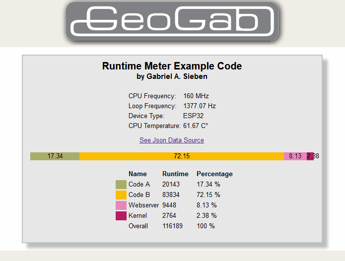
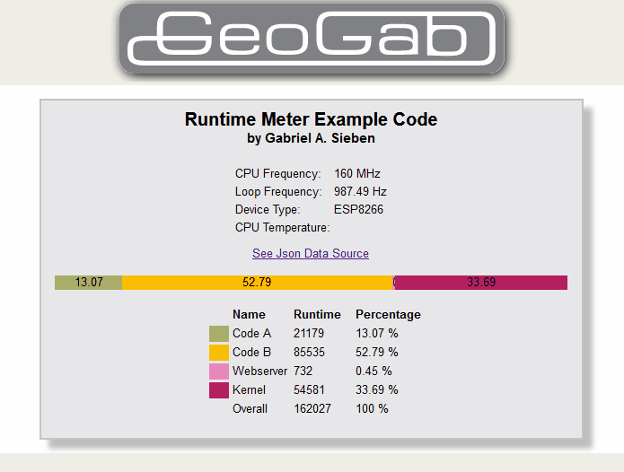

# Gabriel A. Sieben (Physicist)
Here is a little code I wrote for my HomeDev Smarthings projects. I thought it could be useful for others too. Have fun. Gabriel :)

# Runtime Meter V 1.0.4
The **RuntimeMeter** measures the runtime of certain sections of the code of a loop. The sections can be defined freely. This is used to estimate the utilization of the CPU. The word estimation means that there can never be a perfect measurement of the code runtime. (Special code excepted.). Only `if()` conditions cause slight runtime differences. The measurement is to be regarded therefore as exact, but not as precise. Because by nature there are runtime fluctuations in every loop pass. 

It is a widespread misconception that microprocessors are always busy. In fact, I argue that in most cases the CPU is far from being busy. It depends decisively on the code whether they are or not. 

## Tested On
ESP32, ESP8266

# Examples Printout Screenshot


# Example ESP Webserver Screenshot
Here you can see the difference between an 'ESP32' and 'ESP8266'. Both run on 160 MHz. But the ESP32 shows almost no kernel runtime, because the second CPU does the kernel tasks. Especially you should keep an eye on the loop frequency! 



## The effective code
A `delay(x)` can mean an eternity of doing nothing for the processor. This is because modern microprocessors are fast. Even much faster than many assume. Except for `delay(0)`, which we will come back to later. A good programmer should generally do without `delay(x)` and rather trigger the code based on events. Like the `.print(x)` of this library.

A well written program will do without a `delay(x)`. The loop is run completely unbraked. This is sometimes called asynchronous. The code is event driven. Such an event can be, for example, that 1000 milliseconds have passed since the last execution of the code, and the code should be executed now. This is exactly what the `.print(x)` of this library does. It is executed only every `x` milliseconds. Otherwise it does nothing. In this case it should e.g. print the information for the developer on the serial port. 

But with even such a program it can happen that the CPU gets bored. It runs the loop constantly and does not wait. But if there is no event, it does not do anything else than wait for events in the loop. So strictly speaking, it is also a CPU waiting time. And that's where the *RuntimeMeter* comes in. 

## Preliminary to the understanding
At least the programmers of an EPS know. The kernel also needs computing time. So the base system that provides all the great features like WiFi, Serial Port etc.. And we have to take care of that. Because a microprocessor is not a multitasking system, where this happens automatically in the background. Dual processors like the ESP32 are included as a kind of special form. We will come back to this one later. The second core is still ignored in the current version of the *RuntimeMeter*s, but this does not play a role in the runtime determinations of the first core. 
So, as is clear to many, the kernel urgently needs a `yield()`, or `delay()`. But where, when and for how long is not clear to a lot of people. Some functions of the kernel are executed immediately. A `serial.print()` sends the data immediately into the buffer. But if the buffer is full, the `Serial.print()` will not return until the buffer has space again. The web server of the EPS has its own handle, for example. You have to call it specifically in the loop to make the webserver work. But the rest, is executed in the time of the `yield()` or `delay()`. 

There is a "special form" of `delay()` that hardly anyone knows. The `delay(0)`. During `delay(0)` the kernel does all basic tasks and returns without waiting after they are done. 

## The principle of the *RuntimeMeter*.
The *RuntimeMeter* brings light into the shadow. The principle looks like this. 

    loop {
        [start]
            Program code
        [Intermediate]
            Further program code
        [End]

    [Evaluation]
        The determined data are as follows:
        - Runtime between individual measuring points
        - Runtime of the kernel
    }

## What we learn from the acquired data
The *RuntimeMeter* can measure the runtime in processor cycles, micro seconds and milliseconds. The measurement in micro and milliseconds will not be discussed further here, since the principle is the same. They are less precise, but larger runtimes can be measured, which will hardly be needed in practice. More about this later. 

The RutimeMeter measures how many cycles are brought between the measuring point of a loop pass. In the above example there are three runtimes which are measured. Namely:

o [Runtime1]=[Start]-[Intermediate time]
o [Runtime2]=[Intermediate]-[End]
o [Kernel]=within the [End] the kernel runtime is determined. 

So the total runtime of the code inside a loop is `[Loop]=[Runtime1]+[Runtime2]+[Kernel]`. Any code outside of `[start]` and `[end]` is not considered. If possible, it should only be used for data processing, to falsify the measurement results as little as possible. 

The collected data offer us two rudimentary findings:

o In the direct comparison of the run times, one can quickly see which parts of the program take how long. If one changes the code of a part, this can directly affect its runtime.

o The frequency of the loop run. And this is especially important for the "without delay method" of programming. Because as said before: Running in the loop to wait for events is no real processor load. At least not as long as you could reach the same if you check the events less often. If the processor is more loaded, the loop frequency will automatically decrease. Which value is a good value, the programmer must decide for his application. E.g. there are applications where a LED display should be operated with 50Hz. If this is not reached, the *RuntimeMeter* will tell you immediately and you can make appropriate code changes. 

## The runtime fluctuations
As mentioned above, the runtime measurement is subject to slight fluctuations. Everyone can recognize this already alone by the example programs of this library. This is by no means a programming error of the *RuntimeMeter*. The measurements are accurate, but not precise. The accuracy meets the requirements of the *RuntimeMeter*s. It is used for estimation and not for exact measurement. A few cycles faster or slower certainly do not play a role in the flow of a complex program. If the code must be measured exactly, the *RuntimeMeter* is the wrong choice. You will have to translate the code into machine code. Then decompile it back to assembler, which then has to be studied in more detail. Mostly one does not write such programs therefore into a high-level language but directly into Assembler, which is converted mostly directly into machine code. But this shall not be discussed further here.

There are several reasons why runtime variations occur. In the core it is of course always the same reason. A foreign code is executed outside of the own program, which flows into the run time. This code is on the one hand the RutimeMeter Library itself. Even by tricks this cannot be avoided completely. So the first measuring point initializes the first measurement. That's all that needs to happen. Only the second measuring point determines the runtime of the first. Of course, one could further optimize the RutimeMeter at one or the other point. But you would not gain more knowledge. Because the *RuntimeMeter* has hardly any influence on the fluctuations. The far greater part comes from the kernel. As mentioned above, some system tasks are done immediately. Others wait for the `delay()`. 

To determine the runtime more exactly, brings with the small values of the fluctuations, no realization of use. 


## The implementation
## Limitations
### No precession measurement
This has been sufficiently discussed above. Keyword runtime fluctuations. 

### The length of the runtime measurement is limited
I consider the possible length of the transit time measurements to be sufficient. If the runtime in cycles is not sufficient, you can use the mircos and millis method, where microseconds and milliseconds are used instead of cycles. For such "long" runtimes it does not matter if they are still calculated in cycles. The limitation is due to a simple fact. I use "only" 32bit variables. I could also use 64Bit. But then they consume more memory and can't be processed as fast. I will not go into this now.

An unsigned 32 bit variable (uint32_t) can store number up to `2^32=4.294.967.296`. At `2^32` a rollover occurs. That means we would need one bit more (which does not exist). Therefore with the value `uint32_t x=2^32+1` the variable `x` starts again at zero. 

The *RuntimeMeter* counts everything with 32 bits. That means, in case of microseconds, it can store a maximum of 4.294.967.296 microseconds. And this restriction is valid for the single measurement as well as for the total runtime measurement. So all measured values added together must not overwrite 2^32 units (cycles, microseconds, milliseconds). 

In practice these are runtimes up to: 

**Milliseconds**: 1,000 milliseconds = 1 second. => `2^32/1000` seconds => 1 hour is known to be (60 seconds * 60 minutes) => Possible runtime: `2^32/1000/60/60` = 1.193 hours

**Microseconds**: 1,000 microseconds = 1 millisecond => 1,193 h / 1000 = 1.2 hours

**Nanoseconds**: Not useful! With today's µCPUs one 
nanosecond is usually more than 1 CPU tick. (e.g. at 160MHz one tick = 12.5 nanoseconds long).

**Picoseconds**: As above. 

**CPU cycles**: (recommended setting):
Here is a little more complex. For this you need to know what a tick is. The tick is a CPU clock unit. Usually a processor can do one calculation step per clock unit (tick). I will not go into more detail now. 

We know: 1 Second (s) = 1.000 [1E3] Milliseconds (ms) = 1.000.0000 [1E6] Microseconds (µs) = 1.000.000.000 [1E9] Nanoseconds (ns) = 1.000.000.000 [1E12] Picoseconds (ps)

We also know what frequency our CPU is running at. It is usually given in MHz (megahertz) for µCPUs. This is 1,000 Hz (hertz). 1 Hz is once per second. In our case one tick. In the case of the frequency of the loop, one round. This means that a CPU has the frequency times cycles per second. 

Let's consider an ESP8266 with 80 MHz. In one second, the processor can perform 80,000,000 arithmetic operations (I told you. They're fast!). Hertz (Hz) corresponds to the unit 1/sec. So 1/frequency equals the time for one tick. `1/80.000.000 Hz = 0.000.000.012.5 seconds`. So 12.5 nano seconds pass per tick. 

So with 2^32 cycles the time span can be 2^32*12.5 nano seconds:   

CPU Frequency: xxx MHz -> xxx cycles per µs =>.

[**80 MHz**]: ``2^32=4,294,967,296`` => ``4,294,967,296/80`` => ~ ``53,687,091 µs`` => ~ ``53,687 ms`` => ~ ``53 sec``

[**160 MHz**]: ``2^32=4,294,967,296`` => ``4,294,967,296/160`` => ~ ``26,843,545 µs`` => ~ ``26,843 ms`` => ~ ``26 sec``  

[**240 MHz**]: ``2^32=4,294,967,296`` => ``4,294,967,296/240`` => ~ ``7.895.697 µs`` => ~ ``17.895 ms`` => ~ ``17 sec``

Conclusion: Even the 17 seconds loop time for an ESP32 with 240 Hz is more than sufficient. Because 17 seconds is not a reasonable loop time anyway. With this, the system would certainly no longer work well. 


## Application
### For development
The software can be used for analysis purposes during development. If the program does not use the runtimes further, the code can be left in place, but it is not necessary. It can be removed after the development. This saves a little bit of resources. 

### For permanent performance evaluation
The software can be implemented permanently. The resources required are kept within limits. An example can be found in the examples. It is a quick and dirty example web server that lets you retrieve the processor load at any time. The software serves also programs, which permit the loading of strange program code. So the programmer of the foreign program code can observe the influence of his code. Especially for realtime applications this can be very interesting. E.g. the project WLED by Aircookie, which I love very much. 

## Instruction
### Include
``#include <GeoGab*RuntimeMeter*.h>``

### Create object
o *RuntimeMeter* [object name] ([number of slots],[measurement type]);
`*RuntimeMeter* rtmeter();` // 5 slots, RT_MEASURE_CYCLES by default            
`*RuntimeMeter* rtmeter(10, RT_MEASURE_MICROS);` // 10 slots, RT_MEASURE_MICROS         

measurement type: tick: ``RT_MEASURE_CYCLES`` (default) , micros seconds: ``RT_MEASURE_MICROS``, milli seconds: ``RT_MEASURE_MILLIS``

### Measurements
1. add measurement point:
    **Method**: ``Add();``
    **Parameter**: (string) name of the measurement point
    **Return**: (uint32_t) Runtime of the last measurement. 0 = Error;
1. end measurement: 
    **Method**: ``Finalize();`` 
    **Parameter**: (bool) true(default) = measure the kernel time, false: = no kernel time. Keep in mind, however, that then somewhere after the code must follow at least a delay(0);.
    **Return**: (char) error number, where 0 = no error, If you use Print(), you can safely ignore the error message. Print gives a hint. 

**Variants**: 
``rtmeter.add(); // measure point``

*or

``rtmeter.add("name"); // measure point with name (for the following measurement), (default: number of the measurement)``

*or* 

``runtime=rtmeter.add("This measure point"); // return the runtime of the last measure point in uint32_t``

``rtmeter.finalize(); // This must always be the last measure point.``

**Special form**:
``rtmeter.pause(); // Pauses the measurement until the next Add(). The runtime in between is not added to the total runtime``.

### Evaluation
1. print the information for the developer on the Serial.port. 
     **Method**: print();    
    **Parameter**: (uint16_t) Waiting time until next print in milliseconds (default: 1,000).

2. direct access to the public variables of the *RuntimeMeter*:
    There are three groups of variables: 
      * Variables concerning the loop: rtmeter.loop
      * Variables concerning the measuring points: rtmeter.mpslots
      * Additional variables: rtmeter.overall


```cpp
rtmeter.mpslots[no].
      String Name                       // Slot Name
      uint32_t Runtime                  // Runtime
      uint16_t Percentage               // Percentage multiplied by 10 (Divide the number by 10 and you get the first decimal place)
```

```cpp
    rtmeter.overall.
      uint32_t LoopCounter              // Counts the number of loops since program start (no rollover handling)
      uint32_t LastPrintMillis          // Time index at last print
      measurePoint_t kernel             // Kernel (same structure as mpslots) [e.g. rtmeter.overall.kernel.Runtime]
      uint16_t cpuf                     // CPU Frequency
```

```cpp
    rtmeter.loop.
      uint8_t Error                     // Error Number
      uint32_t PrevStamp                // Previous Time Stamp (internal)
      uint32_t ActStamp                 // Actual Time Stamp (internal)
      uint32_t Runtime                  // Loop Runtime
      uint32_t Frequence                // Loop Frequency Hertz multiplied by 10 (Divide the number by 10 and you get the first decimal place) 
      uint16_t SlotIndex                // Index of the actual slot+1 (good for loops)
      bool Finalized                    // Will be set to true once the loop is finalzed (internal)``
```

e.g.

``rtmeter.loop.Runtime; // Overall Runtime``

``(int) rtmeter.loop.Frequence/10;         // Frequency of the loop in Hertz (1/Sekunde) without decimal place``
``(float) rtmeter.loop.Frequence/10;       // Same with decimal place``

``rtmeter.overall.kernel.Runtime``
``rtmeter.mpslots[1].Name                  // Measure Point 2``
``rtmeter.mpslots[0].Runtime               // Measure Point 1``

etc...

### Error codes
The error adds up: there are the following errors:

**0**: 0000 0000: Perfect :-)           

**1**: 0000 0001: More measurement points than slots. Please reserve more slots (*RuntimeMeter* rtmeter(xxx);)   
**2**: 0000 0010: Nothing was measured. You need at least one measurement slot. Add(); and the Finalize();

**4**: 0000 0100: Before the Finalize, Print() makes no sense, because the data has not yet been collected completely. 

**8**: 0000 1000: The collection mode is unknown. Please choose one of the following values: RT_MEASURE_CYCLES, RT_MEASURE_MICROS, RT_MEASURE_MILLIS, RT_MEASURE_SECS

Example: Error *9* (*1+8*) => 0000 1001

### Example

```csharp
RuntimeMeter rtmeter(10); // Allows to measure 10 Points 

loop {
  rtmeter.add("Measurement 1"); // Starts the measurement with a name
    /*... this code will be measured */

  rtmeter.add("Measurement 2); // Sets a measurement point with a name
    /*... this code will be measured */

  uint16 last runtime=rtmeter.add("Measurement 3"); // Sets a measurement point with a name and writes the last runtime into the variable last

  rtmeter.pause(); // Pauses the measurement // uint16 last rtmeter.pause(); 

    /*... This code is not measured. This time frame is also not included in the total runtime */.

  rtmeter.add(); // Starts the measurement again without name

   /* ... this code will be measured */

  rmeter.finalize(); // Finishes the last measurement, measures the kernel runtime, calculates the percentages 

  rmeter.print(1000); // prints the values 1x in the second.
}
```

# Installation
Download the source of my library and unpack it into your libs folder. Include the library with `#define <GeoGab*RuntimeMeter*.h>`. 

Or use the library dependencies in Visual Studio Code including PlatformIO:

lib_deps =
      gsieben/GeoGab RuntimeMeter @ ~1.0.1


# License information
The software is subject to the MIT license model. It is relatively free to use. See license file.

